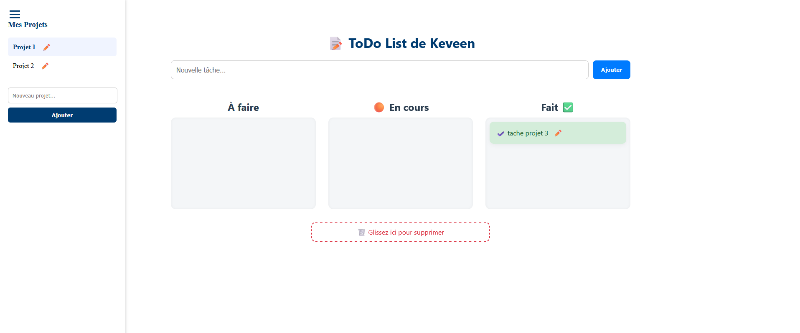
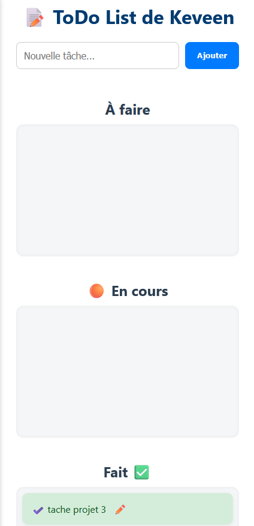

# ✅ Angular ToDo List — Moderne & Animée

Une application Angular 19.2.0 complète pour organiser vos projets, avec une interface moderne, une gestion multi-projets, et des interactions fluides ✨

---

## 🖼️ Aperçu de l'application

### 🖥️ Vue principale



### 📱 Vue mobile



---

## ✨ Fonctionnalités

- 🎨 Interface responsive
- ➕ Ajout de tâches avec animation
- 🟦 Organisation en **3 colonnes** : À faire, En cours, Fait
- ✏️ Modification d’une tâche existante
- 🧺 Glisser-déposer pour déplacer ou supprimer une tâche
- 📦 Données enregistrées en **localStorage**
- 🙋 Saisie du **prénom de l’utilisateur** à la première visite
- 📁 **Multi-projets** : chaque liste est indépendante
- 🧠 **Renommage** et **création de projets** depuis un menu latéral
- 🍔 **Menu burger** pour basculer entre projets facilement
- 🔄 Drag & drop compatible **mobile & desktop**

---

## 🚀 Lancer le projet en local

### 1. Prérequis

- Node.js
- Angular CLI

```bash
npm install -g @angular/cli
```

### 2. Installation

```bash
npm install
```

### 3. Lancement

```bash
ng serve
```

Ouvrir ensuite dans votre navigateur :

```
http://localhost:4200
```

---

## 🧪 Tests

```bash
ng test
```

---

## 🧰 Outils & technologies

- Angular CLI `v19.2.0`
- `@angular/cdk/drag-drop`
- Stockage via `localStorage`
- Pure CSS (aucun framework externe)

---

## 📱 Compatibilité navigateurs

| Navigateur     | Supporté ✅ |
|----------------|------------|
| Chrome         | ✅          |
| Firefox        | ✅          |
| Safari (iOS)   | ✅          |
| Edge / Brave   | ✅          |
| Mobile Android/iOS | ✅      |

---

## 💡 Améliorations futures

- 📲 PWA (application installable)
- ☁️ Sauvegarde en ligne (Firebase, Supabase…)
- 🔔 Rappels & notifications
- 🧾 Sous-tâches ou checklist

---

## ✅ Angular ToDo List — Modern & Animated

A complete Angular 19.2.0 app to manage tasks and projects with a slick dark UI and project-based organization system 🧠

---

## 🖼️ App Screenshots

### 🖥️ Desktop view


### 📱 Mobile view


---

## ✨ Features

- 🎨 Dark and responsive layout
- ➕ Task creation with animation
- 🟦 Organized in **3 columns**: To Do, In Progress, Done
- ✏️ Edit existing tasks
- 🧺 Drag & drop to move or delete tasks
- 🧠 Persistent data via `localStorage`
- 🙋 User's **first name** is requested at first visit
- 📁 **Multi-project support** with independent lists
- 🧠 **Rename** or **create projects** via sidebar
- 🍔 **Burger menu** to switch between projects
- 📱 Full mobile support for drag & drop

---

## 🚀 Getting Started

### 1. Requirements

- Node.js
- Angular CLI

```bash
npm install -g @angular/cli
```

### 2. Install dependencies

```bash
npm install
```

### 3. Run development server

```bash
ng serve
```

Then open in your browser:

```
http://localhost:4200
```

---

## 🧪 Run tests

```bash
ng test
```

---

## 🧰 Tech stack

- Angular CLI `v19.2.0`
- `@angular/cdk/drag-drop`
- Persistent storage via `localStorage`
- Pure CSS (no UI framework)

---

## 📱 Browser compatibility

| Browser        | Supported ✅ |
|----------------|--------------|
| Chrome         | ✅            |
| Firefox        | ✅            |
| Safari (iOS)   | ✅            |
| Edge / Brave   | ✅            |
| Mobile Android/iOS | ✅       |

---

## 💡 Possible Enhancements

- 📲 Installable PWA
- ☁️ Cloud-based sync (Firebase, etc.)
- 🔔 Notifications / reminders
- 🧾 Subtasks or checklists

---

## 👨‍💻 Built with ❤️ by ME