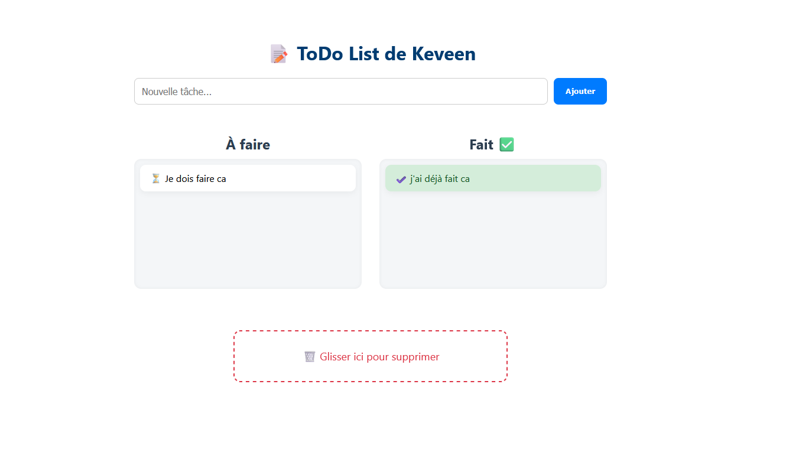
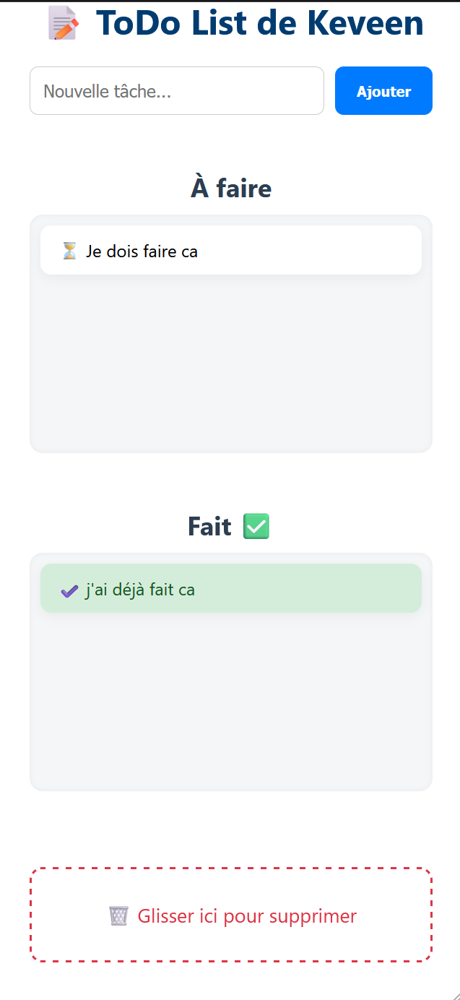

# ✅ Angular ToDo List — Moderne & Animée

Une application Angular 19.2.0 simple mais puissante pour gérer vos tâches quotidiennes, avec une interface moderne, un thème sombre et des interactions en drag & drop 🧠

---

## 🖼️ Aperçu de l'application

### ✅ Vue principale



### 📱 Version mobile



## ✨ Fonctionnalités

- 🎨 Interface sombre et responsive
- 📥 Ajout de tâches via un champ stylisé
- 📤 Drag & Drop intuitif (mobile & desktop)
- 🗑️ Suppression par glisser-déposer vers une corbeille
- ✅ Séparation des tâches "À faire" et "Faites"
- 🧠 Enregistrement **local (LocalStorage)** : les tâches sont conservées même après fermeture de l'application
- 🙋 Demande le **prénom de l'utilisateur** à la première visite (stocké aussi)

---

## 🚀 Lancer le projet en local

Assurez-vous d’avoir installé Node.js & Angular CLI :

```bash
npm install -g @angular/cli
```

### Installation des dépendances :

```bash
npm install
```

### Démarrage du serveur de développement :

```bash
ng serve
```

Puis ouvrez votre navigateur à l’adresse :

```
http://localhost:4200
```

---

## 🧪 Tests

```bash
ng test
```

---

## 🧰 Outils & technologies

- Angular CLI `v19.2.0`
- `@angular/cdk/drag-drop` pour le glisser-déposer
- Stockage via `window.localStorage`
- CSS pur (sans framework UI)

---

## 📱 Compatibilité

| Navigateur     | Supporté ✅ |
|----------------|------------|
| Chrome         | ✅          |
| Firefox        | ✅          |
| Safari (iOS)   | ✅          |
| Edge / Brave   | ✅          |
| Mobile (Android/iOS) | ✅  |

---

## 💡 Améliorations possibles

- 📲 PWA installable
- 🧾 Catégories ou sous-tâches
- ☁️ Base de données (Firebase…)
- 🔔 Notifications

---------------------------------------------------------------

## ✅ Angular ToDo List — Modern & Animated

A simple but powerful Angular 19.2.0 application to manage your daily tasks with a clean dark UI and intuitive drag & drop features 🧠

---

## ✨ Features

- 🎨 Modern dark theme and responsive design
- 📥 Add tasks via a sleek input
- 📤 Intuitive drag & drop (desktop & mobile)
- 🗑️ Remove tasks by dropping them into the trash
- ✅ Organized in “To Do” and “Done”
- 🧠 Data saved locally using LocalStorage (persistent)
- 🙋 Prompts user for their first name on first visit

---

## 🚀 Run the project locally

Make sure Node.js & Angular CLI are installed:

```bash
npm install -g @angular/cli
```

### Install dependencies:

```bash
npm install
```

### Start the dev server:

```bash
ng serve
```

Then open in your browser:

```
http://localhost:4200
```

---

## 🧪 Run tests

```bash
ng test
```

---

## 🧰 Tech stack

- Angular CLI `v19.2.0`
- `@angular/cdk/drag-drop` for drag & drop
- Local storage with `window.localStorage`
- Pure CSS

---

## 📱 Browser Support

| Browser        | Supported ✅ |
|----------------|--------------|
| Chrome         | ✅            |
| Firefox        | ✅            |
| Safari (iOS)   | ✅            |
| Edge / Brave   | ✅            |
| Mobile (Android/iOS) | ✅    |

---

## 💡 Possible Enhancements

- 📲 Installable PWA
- 🧾 Categories or sub-tasks
- ☁️ Cloud storage (e.g. Firebase)
- 🔔 Local reminders/notifications

---

## 🧑‍💻 Built with ❤️ by [Your Name]

> A small project to stay organized... or help your sister be 😉
